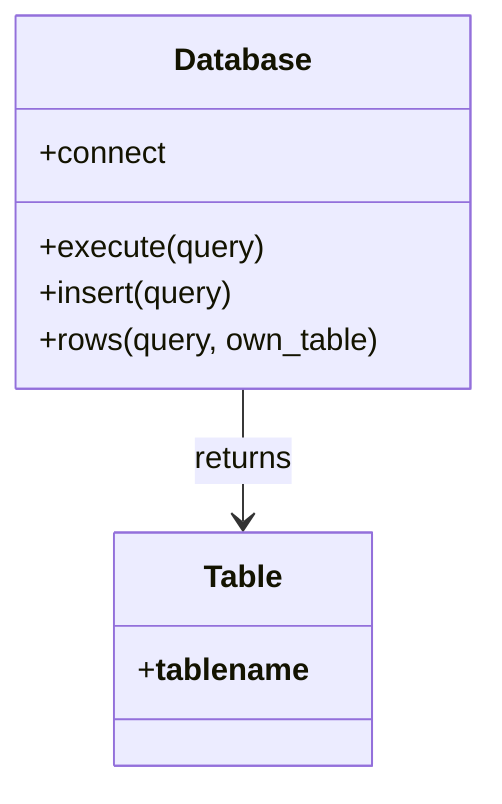

# 4DaysORM Project Structure Analysis

## Project Overview
A lightweight ORM implementation in Lua supporting multiple database backends.

### Directory Structure
```
4DaysORM-master/
├── orm/               # Core ORM implementation
│   ├── class/         # Class definitions (currently empty)
│   ├── tools/         # Utility functions (currently empty)
│   └── model.lua      # Main ORM implementation
└── test/              # Test directory (currently empty)
```

## Core Components

### Database Configuration (`model.lua`)
```lua
DB = {
    new = false,       -- Whether to create new DB
    DEBUG = false,     -- Debug mode
    backtrace = false, -- Error tracing
    type = "sqlite3",  -- Database type
    name = "database.db", -- DB name/path
    host = nil,        -- For remote DBs
    port = nil,        -- For remote DBs
    username = nil,    -- Authentication
    password = nil     -- Authentication
}
```

### Supported Databases
1. SQLite (`sqlite3`)
2. MySQL (`mysql`)
3. PostgreSQL (`postgresql`)
4. Oracle (`oracle` - not fully implemented)

### Database Operations


## Missing Components
1. **Class Definitions**:
   - `orm/class/global.lua`
   - `orm/class/table.lua`

2. **Utility Functions**:
   - `orm/tools/func.lua`

3. **Testing Infrastructure**:
   - Test cases in `test/` directory

## Recommendations
1. Implement missing class definitions
2. Add utility functions
3. Create test suite
4. Add documentation
5. Implement Oracle database support